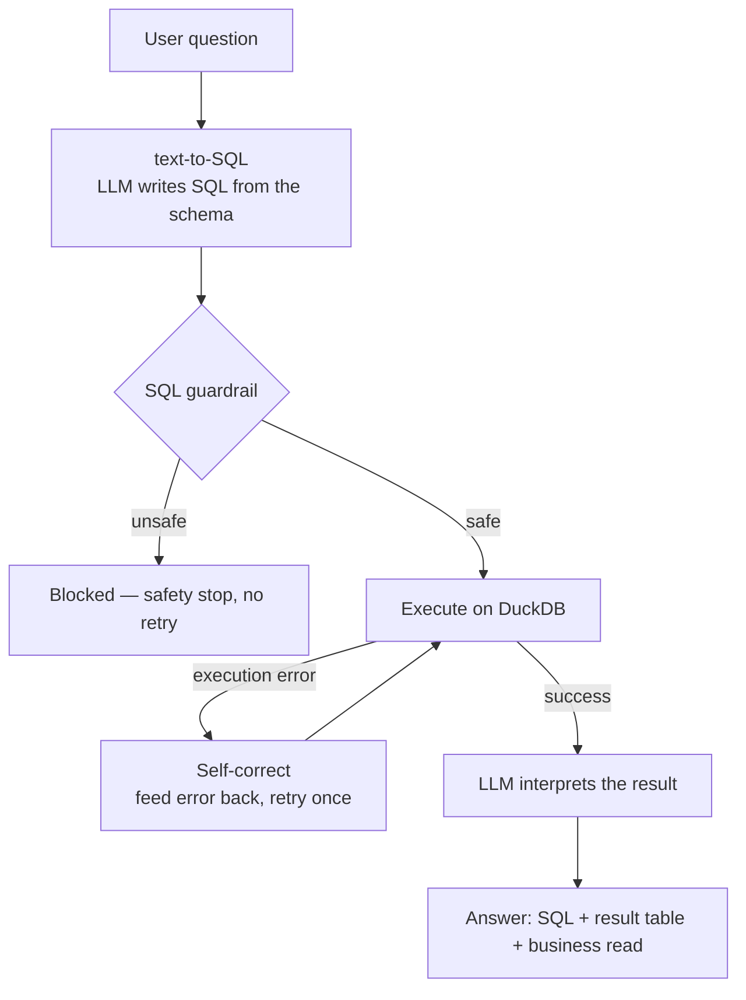

# Text-to-SQL-Analytics-Assistant

A text-to-SQL analytics copilot. Ask a business question in plain English; the
assistant **writes SQL, safety-checks it, runs it on a DuckDB warehouse, and
explains the result** — showing you the exact query and data behind every answer.

**[Live demo](https://ai-business-analyst-assistant-bnzdwzqs6eyetgbfawdnyp.streamlit.app/)**

---

## The problem

Business users constantly need answers from data — "which market is most
efficient?", "which category loses the most to returns?" — but getting them means
opening a dashboard, filtering, and reading numbers manually, or waiting on an
analyst to write SQL.

A generic AI chatbot can't be trusted here: language models *guess* numbers. This
project's design principle is the opposite:

> **The AI writes and runs SQL against real data. It only ever interprets numbers
> it actually computed — it never invents them.**

Every answer surfaces the SQL and the query result, so the work is auditable.

---

## How it works



The pipeline separates **safety failures** from **capability failures**: an unsafe
query is blocked outright, while an execution error gets one self-correction
attempt (the error is fed back to the model to fix).

---

## Design decisions (the "why", not just the "what")

**Why DuckDB, not Postgres or raw CSV?**
A CSV isn't queryable with SQL, and Postgres would need a server, credentials, and
a managed host. DuckDB is an in-process columnar database — zero setup, fast
aggregation, standard SQL, and trivial to deploy on Streamlit Cloud. It gives a
real SQL warehouse with the simplicity of reading a file.

**Why a SQL guardrail?**
The model is helpful but not trusted. Before any query runs, it must pass five
checks: single statement (blocks injection via a second statement), read-only
(SELECT/WITH only), no write/DDL keywords, a table allowlist, and an enforced row
limit. This is the line between *running whatever the AI produced* and
*validating, then executing*.

**Why an evaluation harness?**
Generating answers is easy; knowing how often they're right is the hard part. A
fixed eval set — questions whose correct answers are locked from the real data —
scores the pipeline automatically, so accuracy is measured, not assumed.

---

## Evaluation

`evaluate.py` runs a fixed question set and scores the pipeline against
ground-truth answers verified from the data.

| Metric | Result |
|---|---|
| Eval questions | 10 |
| Accuracy | 10 / 10 (100%) |

The set currently covers single-answer analytical questions across countries,
categories, channels, segments, and quarters. Planned next: multi-condition,
time-trend, and ambiguously-phrased questions to find where it starts to fail.

---

## Tech stack

| Layer | Tech |
|---|---|
| Warehouse | DuckDB |
| text-to-SQL + interpretation | OpenAI API |
| App / UI | Streamlit |
| Data handling | Python · Pandas |
| Charts | Altair |

---

## Dataset

Synthetic APAC e-commerce performance data (6,912 rows: 24 months × 4 countries ×
4 channels × 3 segments × 6 categories). It is **pattern-driven, not random** —
each metric is built as `base × documented business multipliers × small noise`, so
patterns like the Q4 holiday peak, Japan's marketing efficiency, and Fashion's
high return rate are deliberate and explainable. Generated by `generate_data.py`.

---

## Project structure

```
generate_data.py   synthetic, pattern-driven dataset
db.py              DuckDB warehouse + schema introspection
text_to_sql.py     natural language -> SQL (schema-aware prompt)
sql_guard.py       five-check SQL safety validation
pipeline.py        generate -> guard -> execute -> self-correct -> interpret
evaluate.py        eval harness (accuracy scoring)
analytics.py       aggregations powering the dashboard
app.py             Streamlit UI
data/              business_data.csv
```

---

## Run locally

```bash
pip install -r requirements.txt
python generate_data.py          # build data/business_data.csv
python -m streamlit run app.py    # launch the app
```

Set `OPENAI_API_KEY` in a `.env` file (local) or Streamlit Secrets (deployment).
The dashboard works without a key; the AI Q&A needs one.

Useful checks:

```bash
python db.py          # load data + print the schema description
python evaluate.py    # score the text-to-SQL pipeline
```

---

## Disclaimer

The dataset is synthetic and for demonstration. Figures reflect designed business
patterns, not real companies.