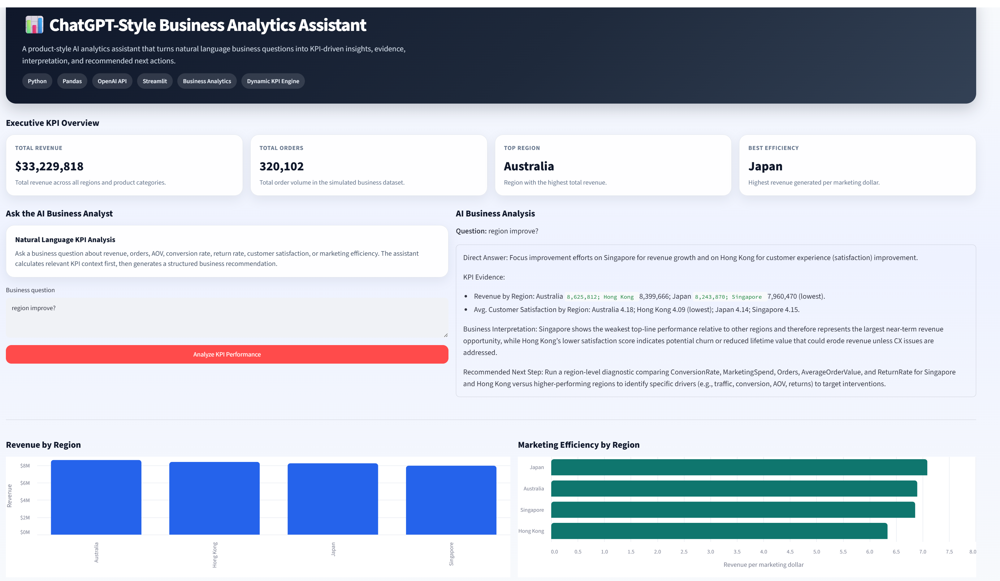

# ChatGPT-Style Business Analytics Assistant

An AI-powered business analytics assistant that allows users to ask natural language questions about e-commerce KPI performance and receive structured, KPI-backed business insights.

This project demonstrates how Python, Pandas, Streamlit, and the OpenAI API can be combined to create a lightweight analytics copilot for business users.

---

## Project Overview

Business users often need quick answers to performance questions such as:

* Which region has the best marketing efficiency?
* Which product category has the highest return rate?
* Which region generated the highest revenue?
* Which category has the highest average order value?
* What are the key regional performance risks?

Instead of manually reviewing spreadsheets or dashboards, this assistant allows users to ask questions in natural language and receive a structured business response with:

* Direct Answer
* KPI Evidence
* Business Interpretation
* Recommended Next Step

---

## Key Features

* ChatGPT-style natural language question answering
* Dynamic KPI engine using Python and Pandas
* AI-generated business insights using the OpenAI API
* Streamlit web interface for interactive analysis
* Executive KPI overview cards
* Revenue and marketing efficiency visualizations
* Data explorer for regional and product category performance
* Structured business response format for decision-making

---

## Tech Stack

* Python
* Pandas
* OpenAI API
* Streamlit
* Altair
* python-dotenv

---

## Dataset

This project uses a simulated retail / e-commerce business performance dataset.

The dataset includes:

* Month
* Region
* Product Category
* Revenue
* Orders
* Customers
* Average Order Value
* Conversion Rate
* Marketing Spend
* Return Rate
* Customer Satisfaction

The data is synthetic and created for portfolio demonstration purposes.

---

## How It Works

```text
Business Question
↓
Dynamic KPI Selection
↓
Pandas Calculation
↓
Prompt Context
↓
OpenAI Response
↓
Business Insight
```

The assistant does not rely on the language model to calculate KPIs by guessing.

Instead, the Python data layer calculates the relevant KPI results first. The calculated results are then passed to the OpenAI model as context, and the model explains the results in clear business language.

---

## Example Questions

```text
Which region has the best marketing efficiency?
```

```text
Which product category has the highest return rate?
```

```text
Which category has the highest AOV?
```

```text
Summarize regional performance.
```

---

## Example AI Response Format

```text
Direct Answer:
Japan has the best marketing efficiency, generating $7.09 in revenue per marketing dollar.

KPI Evidence:
Japan generated $8,243,870 in revenue with $1,163,118 in marketing spend.

Business Interpretation:
Japan is converting marketing investment into revenue more efficiently than other regions.

Recommended Next Step:
Review Japan’s marketing strategy and test whether similar tactics can be applied to lower-efficiency regions.
```

---

## Screenshot



---

## Project Structure

```text
AI-Business-Analyst-Assistant/
│
├── app.py
├── main.py
├── generate_data.py
├── requirements.txt
├── README.md
├── .env.example
├── .gitignore
│
├── data/
│   └── business_data.csv
│
└── screenshots/
    └── dashboard_home.png
```

---

## How to Run Locally

### 1. Clone the repository

```bash
git clone https://github.com/Keithtam-AIdata/AI-Business-Analyst-Assistant.git
cd AI-Business-Analyst-Assistant
```

### 2. Install dependencies

```bash
pip install -r requirements.txt
```

### 3. Create environment file

Copy `.env.example` and rename it to `.env`.

Then add your OpenAI API key:

```text
OPENAI_API_KEY=your_openai_api_key_here
```

### 4. Run the Streamlit app

```bash
python -m streamlit run app.py
```

---

## Business Value

This project shows how a business analytics workflow can be enhanced with AI.

Instead of only showing static dashboard metrics, the assistant helps users interpret KPI performance, identify risks, and generate recommended actions.

This makes the project relevant to roles such as:

* Data Analyst
* BI Analyst
* Analytics Engineer
* AI Data Specialist
* Business Intelligence Developer
* AI Solutions Analyst

---

## Future Enhancements

* Add user-uploaded CSV support
* Add more advanced KPI intent detection
* Add monthly trend analysis
* Add conversation history
* Add deployment with Streamlit Community Cloud
* Add document-based RAG support for business reports
* Add authentication and usage control for public demo deployment

---

## Disclaimer

This project uses synthetic data for demonstration purposes only. No real business or customer data is included.
